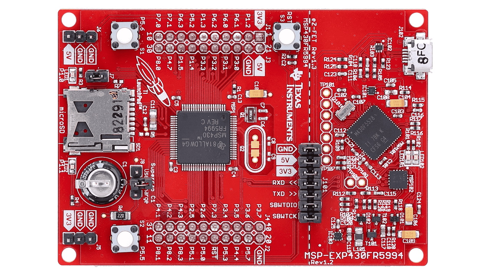
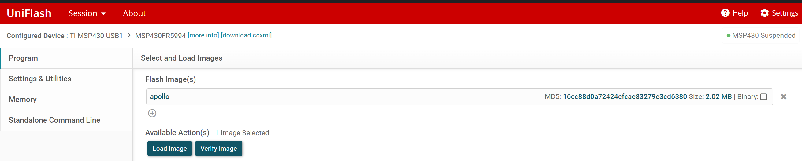
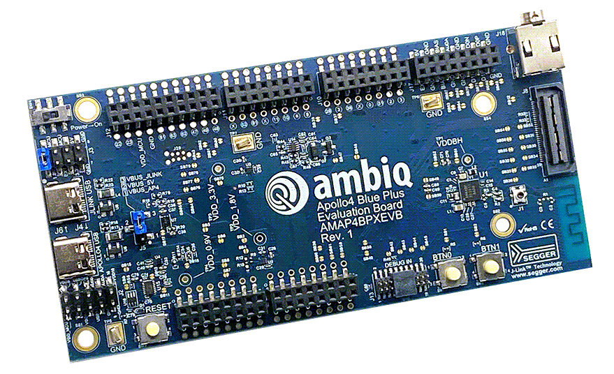

<!-- TOC --><a name="overview"></a>
# Overview
IntOS is an intermittent multithreaded embedded RTOS based on FreeRTOS for research. It features transaction with replay and bypass to enable cheap crash consistency.
The kernel and user appliaction are all written in the Rust programming language. The Rust type system is used to enforce safe programming rules defined by the framework
to guarantee the crash consistency and Persistent Memory Safty.

Currently, we support three platforms: QEMU, Apollo 4 Blue Plus, MSP430Fr5994. For evaluation of functionality, please just follow the instruction for QEMU.

# Table of Content
- [Overview](#overview)

- [Getting Startted](#getting-started)
    * [System Requirement](#system-requirement)
    * [Use Docker](#use-docker)
    * [Install Dependency](#install-the-system-dependency)
    * [How to Compile](#how-to-compile)
    * [Configuration Paramters](#configuration-parameters)
    * [Failure Injection](#inject-failure)
- [Detailed Instructions](#detailed-instrs)
    * [Instructions for QEMU](#how-to-qemu)
    * [Instructions for MSP430FR5994](#how-to-msp)
    * [Instructions for APOLLP4](#how-to-apollo)
    * [Write Your Own Application](#how-to-write-an-app)
- [API Reference](#api-reference)


<!-- TOC --><a name="getting-started"></a>
# Getting Started

<!-- TOC --><a name="system-requirement"></a>
## System Requirement
Ubuntu 22.04


<!-- TOC --><a name="use-docker"></a>
## Use Docker
We provide a docker file that configure the required development environment (Make sure you have permission to run docker on your system). 
Build the docker image using our docker file
```console
docker build -t rtosdev .
```

Run the docker image
```console
docker run -v $(pwd):/repo  -it rtosdev bash 
```
If you choose to use the docker, the following dependency/toolchain installation can be skipped.


<!-- TOC --><a name="install-dependency"></a>
## Install the System Dependency
```console
sudo apt install curl wget p7zip-full libncurses5 libncursesw5 build-essential qemu-system-arm
```

## Install the Rust toolchain
Install the default rust toolchain on your platform
```console
curl --proto '=https' --tlsv1.2 -sSf https://sh.rustup.rs | sh -s -- -y
```
Then, install the version of the nightly compiler used by this project
```console
rustup toolchain add nightly-2022-04-01
```

<!-- TOC --><a name="how-to-compile"></a>
## How to compile and run benchmark applications
You can compile the os and benchmarks/example applications using the provided python script
```console
./compile.py --board [qemu|apollo4bp|msp430fr5994] --bench [app name] [--run (for qemu)]
```
For example, if you want to run the "bc" app using QEMU:
```console
./compile.py --board qemu --bench bc --run
```
For valid `--bench` name, please refer to this [section](#benchmark-applications)

To clean up the build files under `target/` directory, run
```console
cargo clean
```

<!-- TOC --><a name="configurition-parameters"></a>
## Configuration Parameters
There are many parameters you can pass to compile.py to enable or disable certain features of the OS.
Here we list a few important ones. For a complete list, run the `compile.py -h`.
<br>
| Arg |            Description       |
| ---------|---------------------------- | 
| --board | Specify the target development boards: qemu or msp430fr5994 or apollo4bp | 
| --bench  | Specify the benchmark app to run, if not specified, a user registered app will be run |
| --fail   | Run with power failure injection |
| --pf_freq  | Used with --fail, specify power failure frequency. e.g. 1ms, 5ms |
| --debug_bench | Print out benchmark application specific debug messages |
| --size_opt  |  Size optimization to optimize for binary size instead of speed |
| --timer_daemon | Enable timer daemon |

For direct manipulation of features, you can inspect and modify cargo.toml config/.config or build.rs

## Benchmark Applications

| App Name |            Description       |
| ---------|---------------------------- | 
| bc       | Count the number of 1s in an integer using multiple algorithms | 
| dnn      | Multi-layer perception with two fully connected layers     |  
| ar       | Train an activity recognition model and analyze the activities    |
| kv       | Two threads perform concurrent operations on KV Store with locks     |
| sense    | Periodic Sensing using software timers   |
| em       | One thread monitors events and notifies other threads with event groups |
| mq       | One thread distribute messages to other threads using queues |
| etl      | ETL Extract, Transform and Load dataflow in RIoTBench  |
| pred     | Predictive analysis dataflow in RIoTBench   |
| stats    | Statistic summerization dataflow in RIoTBench   |
| train    | Model training dataflow in RIoTBench    |

<!-- TOC --><a name="inject-failure"></a>
## How to Inject Power Failure
```console
./compile.py --board [board name] --bench [app name] --fail --pf_freq [frequency: e.g. 1ms]  [--run (for qemu)]
```

<!-- TOC --><a name="detailed-instrs"></a>
# Detailed Instructions

<!-- TOC --><a name="how-to-qemu"></a>
## Instructions for running with QEMU
### Run
```console
./compile.py --board qemu --bench [app name] --run
```
### Quit QEMU after completion
Press Ctrl-A + X. (First Press Ctrl-A then Press X)

### Run with failure injection
```console
./compile.py --board qemu --bench [app name] --fail --pf_freq 1ms --run
```
Example for running the "pred" riotbench application:
```console
./compile.py --board qemu --bench pred --run
```

### Note
QEMU is not a cycle-accurate simulator and doesn't have NVM emulation. The timing and performance informaton may be very inaccruate.
Don't use it for performance evaluation.


<!-- TOC --><a name="how-to-msp"></a>
## Instructions for the MSP430FR5994 platform


### Install MSP GCC toolchain
Download the installer from https://www.ti.com/tool/MSP430-GCC-OPENSOURCE
```console
wget https://dr-download.ti.com/software-development/ide-configuration-compiler-or-debugger/MD-LlCjWuAbzH/9.3.1.2/msp430-gcc-full-linux-x64-installer-9.3.1.2.7z
```
```console
p7zip -d msp430-gcc-full-linux-x64-installer-9.3.1.2.7z
```

Run the installer with root permission and install it into <INSTALL_PATH>
```console
sudo ./msp430-gcc-full-linux-x64-installer-9.3.1.2.run --prefix "<INSTALL_PATH>" --mode unattended
```

Export the path and add it to your terminal config file (e.g. .bashrc/.zshrc) 
```console
export PATH=$PATH:<INSTALL_PATH>/bin
```

### Compile for MSP430FR5994
```console
./compile.py --board msp430fr5994 --bench [app] [other optional arguments]
```

### Size Optimization
The LLVM compiler rust uses can only use 64KB of MSP430FR994's FRAM. If you can't fit the application into the memory, try to pass the --size_opt flag or tweak the cargo.toml. For the train app, some size optimization is needed. The output for binary compiled using --size_opt flag is under target/<...>/release-opt-size folder.

### Flash and run the application on MSP430FR5994
You can install the TI's [Uniflash](https://www.ti.com/tool/UNIFLASH) or [CCSTUDIO IDE](https://www.ti.com/tool/CCSTUDIO) to flash the application binary (located under target/msp430-none-elf/release/) onto the board.

### View the UART output from the application
The kernel and application may print helpful performance measurement and debugging message through UART interface.
The default Baud Rate is 115200. You can use any Serial Monitor tools to view the printed message. For example, on Linux/Win, you can install the [Serial Monitor Plugin](https://marketplace.visualstudio.com/items?itemName=ms-vscode.vscode-serial-monitor). [Termite](https://www.compuphase.com/software_termite.htm) is another handy tool you can use. 


Uniflash Interface, uncheck the binary box when you load.





Sample VSCode Serial Monitor output 


<!-- TOC --><a name="how-to-apollo"></a>
## Instructions for the Apollo 4 Blue Plus platform


### Compile
```console
./compile.py --board apollo4bp --bench [app] [other optional arguments]
```

### Flash and run the applicaiton with APOLLO 4 Blue Plus

#### Download the JLink and ARM toolchain
1. Download the Segger JLink tools (v7.92) on your platform from their [website](https://www.segger.com/downloads/jlink/)
2. Download ARM (arm-none-eabi) toolchain (version 12.3.Rel1) from the [website] (https://developer.arm.com/downloads/-/arm-gnu-toolchain-downloads)

#### Use GDB and JLink to load and run the application
In one terminal run:
```console
JLinkGDBServer -if SWD -device AMA4B2KP-KXR
```

In another terminal run:
```console
arm-none-eabi-gdb -x apollo.gdb <path/to/binary>
```

After the binary is loaded onto the board, enter 'c' to run. The application will print message to the gdb interface and port 2333 (TCP/IP)  .

<!-- TOC --><a name="how-to-write-an-app"></a>
## Write your own application
Here we give an simple example of two task communicating using a Queue (i.e. IPC).
The full code can be found in the [demo.rs](./src/app/demo.rs) file 

First, we need to create the function for task ```ping```
```rust
#[app]
pub fn task_ping() {
    // First create pong task, and the queue
    let (msg_q, v_boxed) = transaction::run_sys(|j, t| {
        let q = sys_queue_create::<usize>(1, t).unwrap();
        sys_create_task("pong", 1, task_pong, q, t).unwrap();
        let v = PBox::new(0, t);
        return (q,v);
    });
    
    // Loop to send messages
    nv_loop!({
        transaction::run_sys(|j, t| {
            let v_ref = v_boxed.as_mut(j);
            sys_queue_send_back(msg_q, *v_ref, 5000, t);
            task_print!("Value sent: {}", *v_ref);
            *v_ref += 1;
            sys_task_delay(10);
        });
    });
}
```
The transaction::run_sys() is used to create a transaction that contains syscall invocations. The ping task needs to first 
create the Queue with `sys_queue_create` syscall. It will then create the `task_pong` using `sys_create_task` syscall and pass the
queue handle as a parameter. Finally, it will allocate a persistent counter that increases in every loop iteration from PMEM heap using PBox API (similar to Box in std Rust). In the end, the queue handle and the PBox object are returned.

After return from the first transaction, the task will enter a loop, that is persistent and contains transactions. `nv_loop!` is used to create such a infinite persistent loop. Inside the loop, the task executes a transaction that does two things. First, it will dereference the PBox object and push the value into the queue with a timeout of 5000 ticks. `v_boxed.as_mut(j)` obtains a mutable reference and receive the jounral handle `j` as an argument. Undo-logging is automatically performed upon first dereference. Second, it will increase the value by one and delay for some ticks.

Next, we need to write the code for `task_pong`.

```rust
#[app]
fn task_pong(q: QueueHandle<usize>) {
    // Loop to receive messages
    nv_loop!({
        transaction::run_sys(|j, t| {
            let v = sys_queue_receive(q, 5000, t).unwrap();
            #[cfg(board="msp430fr5994")]
            crate::board::msp430fr5994::peripherals::led_toggle();
            task_print!("Value received: {}", v);
        });
    });
}
```

The `task_pong` receives the queue handle `q` as the argument. Inside the persistent loop, it invokes
the syscall `sys_queue_receive` to receive messages from the other task. the argument `t` is simply a
void token to enforce the syscall to be only invoked inside the transaction. If there is no message in the buffer,
the call will block and the task will yield control to other ready tasks until some message arrives. Once the
message is received, the task wil toggle the LED light on the MSP430FR5994 board (if targeted on this board) and print
out a message. If you use the MSP board, you will see the LED blink.

At last, we need to register the app in the main.rs
```rust
// main.rs
fn main() {
    #[cfg(app = "demo")]
    task::register_app_no_param("ping", 1, crate::app::demo::task_ping);
}
```

To run the app, you can just use the compile.py script. Here we use qemu as an example.
```console
./compile.py --board qemu --app demo --run
```

For more examples, please refer to [example.rs](./src/tests/examples.rs) 

<!-- TOC --><a name="api-reference"></a>
# API Reference
See [syscall.rs](./src/syscalls.rs) and [user/](./src//user/)

<!-- Copy the libmsp430.so file to /usr/lib
```console
sudo cp <INSTALL_PATH>/bin/libmsp430.so /usr/lib/
``` -->

<!-- ## Install MSPDEBUG (Flasher) for MSP

### Install Dependency Library
```console
sudo apt-get install libusb-dev libreadline-dev
```
### Download the source code (v0.25) for MSPDEBUG 
```console
wget https://github.com/dlbeer/mspdebug/archive/refs/tags/v0.25.tar.gz
```
### Extract and Compile
```console
tar -xvf v0.25.tar.gz
cd mspdebug-0.25
make
```
### Install
```console
sudo make install
```

## Use MSPDEBUG and GDB to burn and run the application
In one terminal, run the MSPDEBUG
```console
mspdebug -C mspdebug.cfg tilib
```
After connection is established, in the second terminal, use screen to view the serial output from the app. 
(It may be /dev/ttyACM1, please check the output of mspdebug)
```console
screen /dev/ttyACM0
```
In the third terminal, invoke gdb
```console
msp430-elf-gdb -x mspdebug.gdb target/msp430-none-elf/release/<app_name>
```
Press c to run -->
